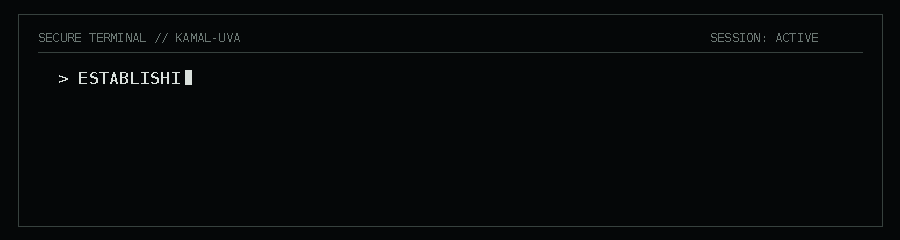

  

 

# Kamal Sangameswaran

**Software Engineer · AI/ML · Cloud · Simulation**

*Building intelligent systems that survive contact with the real world.*

---

# ◉ MISSION BRIEFING

I'm a Computer Science student at the **University of Virginia** interested in building software where intelligent systems meet real-world constraints.

My work has included:
- cloud and backend systems processing **millions of records**
- multi-agent reinforcement learning and simulation
- full-stack applications and data engineering
- race-strategy software for **UVA Solar Car**

I'm especially interested in **AI/ML systems, reinforcement learning, cloud engineering, and simulation**.

 

# ◉ CURRENT MISSION

### UVA Solar Car — Simulation Team Lead

I'm leading development of simulation software used to explore a deceptively difficult question:

> **How fast should we drive to maximize race performance without running out of energy?**

The simulator compares race strategies against vehicle physics, solar input, weather forecasts, battery state, and other energy constraints to support pre-race planning.

My work also includes building a parameter-management system for tracking the **quality and source of vehicle data**, replacing manual configuration and reducing simulator setup time by ~40%.

 

# ◉ CHOOSE YOUR MISSION

My pinned repositories cover different sides of the work I enjoy doing. Pick the one closest to the kind of engineering you're evaluating.

### SIMULATION / ENGINEERING — [Solar Car Simulator](https://github.com/solarcaratuva/simulation)
`Python` · `Simulation` · `Control Strategies` · `Energy Modeling`

Race-planning software for comparing vehicle behavior, weather assumptions, battery state, and competing speed-control strategies.

### FULL-STACK SYSTEMS — [Mosaic](https://github.com/kamal-uva/Mosaic)
`React` · `Node.js` · `Express` · `MySQL`

A local knowledge-management system for organizing and connecting notes, PDFs, images, audio, and video. I worked as the **Full-Stack / Systems Integration Lead**, connecting the frontend, backend, and database layers.

### REINFORCEMENT LEARNING — [Q-Learning Projects](https://github.com/kamal-uva/Q-Learning-Projects)
`Python` · `NumPy` · `Q-Learning`

Implementations ranging from a minimal state environment to a GridWorld agent using epsilon-greedy exploration and learned-policy visualization.

### DATA ENGINEERING — [Data Science Capstone](https://github.com/kamal-uva/DataScience2002Capstone)
`PySpark` · `Delta Lake` · `MySQL` · `MongoDB`

A dimensional lakehouse integrating relational, document, local-file, and streaming sources through a **Bronze → Silver → Gold** architecture.

### WEB APPLICATIONS — [ClubReviewer](https://github.com/kamal-uva/ClubReviewer)
`Django` · `PostgreSQL` · `AWS S3`

A multi-user club discovery and communication platform with Google authentication, profiles, club management, officer messaging, threaded conversations, and administrative roles.

### JAVA / APPLICATION DESIGN — [CourseReview](https://github.com/kamal-uva/CourseReview)
`Java` · `SQL`

A collaborative course-review application. My work focused on login and account creation, validation, database integration, error handling, and debugging application/database behavior.

 

# ◉ FIELD EXPERIENCE

### Software Engineering @ Fannie Mae
`AWS` · `Data Engineering` · `Backend Systems` · `RAG`

Built cloud and backend systems spanning a **5.2M-record data pipeline**, semantic retrieval for an AI agent, and APIs supporting loan-data workflows.

### Multi-Agent Reinforcement Learning @ UVA
`Python` · `PyTorch` · `Deep RL` · `Simulation`

Extended an emergency-response simulation and trained multi-agent reinforcement-learning systems coordinating teams of **20+ agents**.

### Software Engineering @ Stork Technologies
`React` · `Tailwind` · `AWS S3` · `SNS` · `API Gateway`

Rebuilt the company's web experience in React and developed AWS workflows for resume intake and user-data processing.

 

# ◉ Q BRANCH

### Languages
`Python` · `Java` · `JavaScript` · `SQL` · `C` · `C++`

### Frameworks & ML
`PyTorch` · `TensorFlow` · `Spring Boot` · `React` · `Django` · `Pandas` · `NumPy`

### Cloud & Infrastructure
`AWS` · `Docker` · `Terraform` · `PostgreSQL` · `pgvector`

---

### `> TRANSMISSION OPEN_`

[LinkedIn](https://www.linkedin.com/in/kamalsangam) · [Email](mailto:kamalsangam1@gmail.com)

